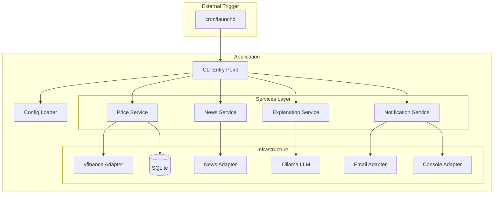
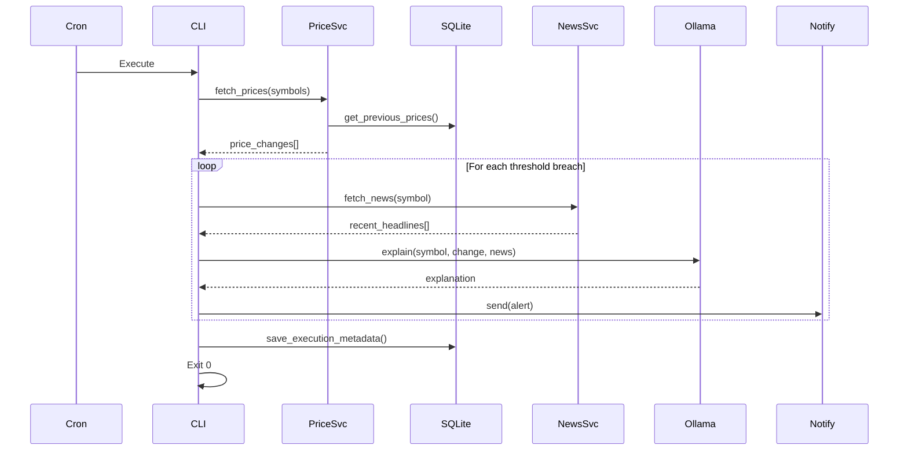
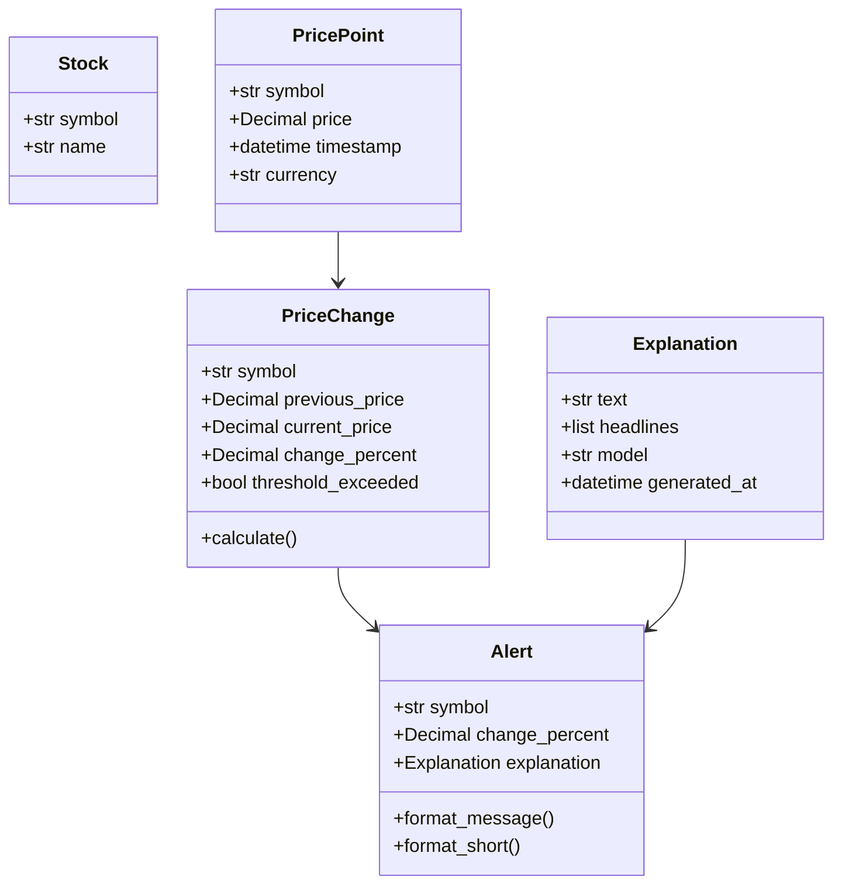
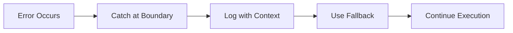

# System Architecture

## Overview

Stock Tracker is a local-first stock monitoring agent that detects meaningful price movements and generates LLM-powered explanations. The system runs periodically via cron/launchd, processes alerts, and exits.

---

## High-Level Architecture



---

## Execution Flow



---

## Component Responsibilities

### Presentation Layer

| Component | Responsibility |
|-----------|----------------|
| CLI (main.py) | Parse commands, orchestrate flow, handle output |

### Services Layer

| Component | Responsibility |
|-----------|----------------|
| Price Service | Fetch prices, detect threshold breaches |
| News Service | Fetch recent headlines for context |
| Explanation Service | Generate LLM-powered explanations |
| Notification Service | Route alerts to configured channel |

### Infrastructure Layer

| Component | Responsibility |
|-----------|----------------|
| YFinance Adapter | Fetch stock prices from Yahoo Finance |
| News Adapter | Fetch headlines via Google News RSS |
| Ollama Adapter | Generate explanations via local LLM |
| Email Adapter | Send email notifications via SMTP |
| Storage Adapter | Persist data to SQLite |

---

## Data Models



---

## Design Principles

### Dependency Rule

Dependencies point inward. Inner layers know nothing about outer layers.

```
CLI → Services → Domain ← Infrastructure
```

### Interface Segregation

Services depend on abstractions (adapters), not concrete implementations.

### Single Responsibility

Each component has one reason to change:
- Price Service: Price fetching logic
- News Service: News fetching logic
- Explanation Service: LLM interaction
- Notification Service: Alert delivery

### Fail-Safe Defaults

- LLM unavailable → Fallback explanation generated
- Email fails → Fallback to console output
- News unavailable → Explanation without headlines

---

## Error Handling Strategy



- Errors are caught at service boundaries
- Infrastructure errors are logged with full context
- User-facing errors are clean and actionable
- Stack traces never exposed to users
- Execution continues with fallbacks when possible

---

## Storage Schema

### price_history
| Column | Type | Description |
|--------|------|-------------|
| id | INTEGER | Primary key |
| symbol | TEXT | Stock ticker |
| price | TEXT | Decimal as string |
| currency | TEXT | Currency code |
| timestamp | TIMESTAMP | Price observation time |

### execution_log
| Column | Type | Description |
|--------|------|-------------|
| id | INTEGER | Primary key |
| started_at | TIMESTAMP | Execution start |
| completed_at | TIMESTAMP | Execution end |
| alerts_triggered | INTEGER | Count of alerts |
| success | INTEGER | 1 or 0 |
| error_message | TEXT | Error if failed |

### alerts
| Column | Type | Description |
|--------|------|-------------|
| id | INTEGER | Primary key |
| symbol | TEXT | Stock ticker |
| change_percent | TEXT | Change as string |
| explanation | TEXT | Generated text |
| notified | INTEGER | 1 if sent |

---

## Performance Budget

| Step | Target |
|------|--------|
| Load config | <100ms |
| Fetch prices (5 symbols) | <3s |
| Fetch news (per alert) | <2s |
| LLM explanation (per alert) | <15s |
| Send notification | <2s |
| **Total (1 alert)** | **<25s** |

---

## Future Considerations

Areas identified for potential expansion (not current scope):

- SMS notifications via Twilio (v0.2)
- Web interface for configuration
- Multiple LLM provider support
- Batch notification scheduling

These are documented for awareness, not implementation.
