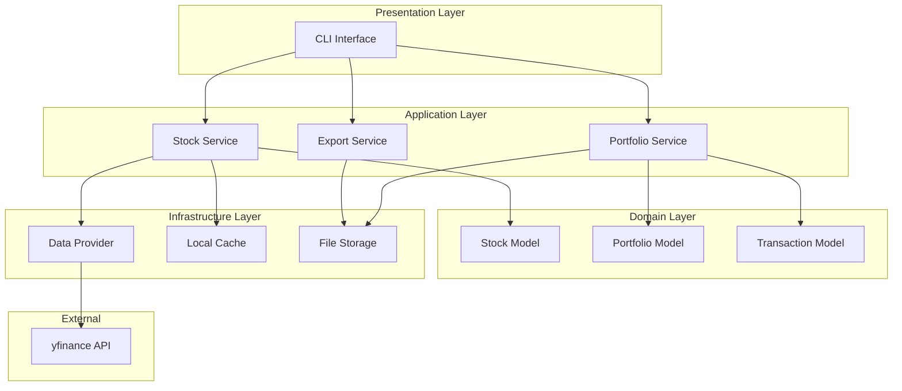
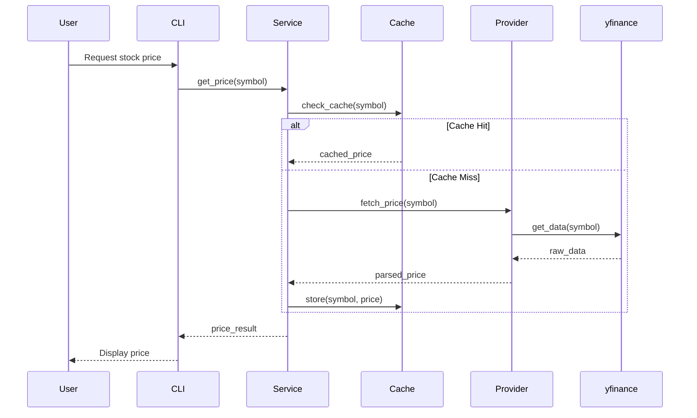
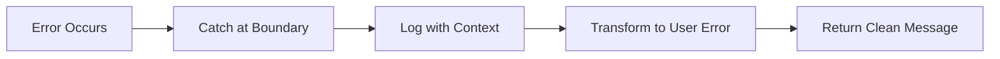

# System Architecture

## Overview

Stock Tracker follows a layered architecture with clear separation of concerns. The system is designed for local execution with no cloud dependencies.

---

## High-Level Architecture



---

## Data Flow



---

## Component Responsibilities

### Presentation Layer
| Component | Responsibility |
|-----------|----------------|
| CLI Interface | Parse commands, format output, handle user interaction |

### Application Layer
| Component | Responsibility |
|-----------|----------------|
| Stock Service | Fetch and process stock data |
| Portfolio Service | Manage holdings, calculate performance |
| Export Service | Generate CSV/JSON exports |

### Domain Layer
| Component | Responsibility |
|-----------|----------------|
| Stock Model | Represent stock data with validation |
| Portfolio Model | Represent holdings and positions |
| Transaction Model | Represent buy/sell transactions |

### Infrastructure Layer
| Component | Responsibility |
|-----------|----------------|
| Data Provider | Abstract external API access |
| Local Cache | Cache responses to reduce API calls |
| File Storage | Persist portfolio data locally |

---

## Design Principles

### Dependency Rule
Dependencies point inward. Inner layers know nothing about outer layers.

```
Presentation → Application → Domain ← Infrastructure
```

### Interface Segregation
Services depend on abstractions, not concrete implementations.

```python
# Abstract interface
class DataProvider(Protocol):
    def fetch_price(self, symbol: str) -> float: ...

# Concrete implementation
class YFinanceProvider:
    def fetch_price(self, symbol: str) -> float:
        # Implementation details
```

### Single Responsibility
Each component has one reason to change.

---

## Error Handling Strategy



- Errors are caught at service boundaries
- Infrastructure errors are logged with full context
- User-facing errors are clean and actionable
- Stack traces never exposed to users

---

## Future Considerations

Areas identified for potential expansion (not current scope):

- Web interface (if needed)
- Database storage (if file storage becomes limiting)
- Background refresh (if real-time data needed)

These are documented for awareness, not implementation.
